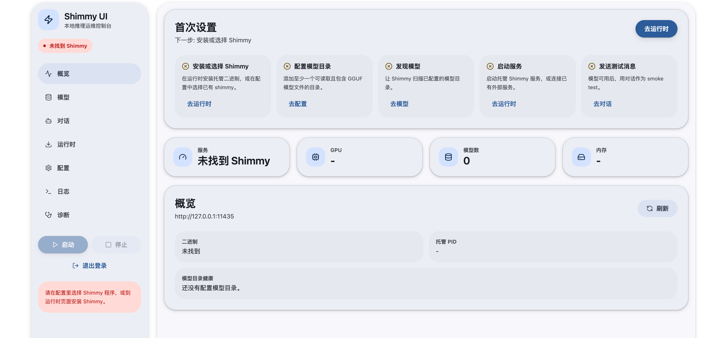

# Shimmy UI

vibe by codex， 让我们谢谢 codex。

**中文** | [English](./README.en.md)

用于管理和运维 Shimmy 推理服务的本地 Web UI。



## 功能说明

- 从已保存配置、`PATH`、项目根目录或 `~/bin` 自动探测本地 `shimmy` binary。
- 检查最新 GitHub Release，并匹配当前平台可用资产。
- 支持下载、sha256 校验、安装、更新、卸载、回滚（仅管理 Shimmy UI 托管的 runtime）。
- 仅启动和停止由本 UI 拉起的 Shimmy 进程。
- 支持连接外部 Shimmy 服务，不会误杀外部服务。
- 提供 `/health`、`/metrics`、`/api/models`、`/api/models/discover` 读取与 `/v1/chat/completions` 代理。
- 支持设置本地聊天面板默认模型。
- 提供 2 条模型下载通道，并带兼容性控制：
  - Curated GGUF catalog（`/api/model-library/catalog` + `/api/model-library/download`）：仅允许 checksum 校验通过且标记兼容的模型安装。
  - Ollama Bridge（`/api/model-library/ollama/*`）：通过 Ollama 拉取后会再次校验是否满足 `GGUF + completion`，不兼容会自动删除。
- Hugging Face 下载任务支持进度可视化（phase、百分比、`已下载 / 总大小`、ETA）、页面刷新后恢复显示、同文件并发下载锁与断点续传（服务端支持 `Range` 时）。
- 提供可选登录页鉴权（`/login`），会话使用 HttpOnly Cookie。
- 本地 UI 配置默认存储在 `~/.shimmy-ui/config.json`。
- Runtime 元数据默认存储在 `~/.shimmy-ui/runtime.json`。

Runtime 安装范围严格限制在 `~/.shimmy-ui/bin`。卸载只会删除 Shimmy UI 托管 binary，不会删除系统安装的 `shimmy`（例如 `/usr/local/bin`、`PATH`、Homebrew、Cargo 等来源）。

## 开发

零依赖本地预览：

```bash
npm run web
```

访问 `http://127.0.0.1:37645`。

隔离 smoke 测试可使用临时配置路径：

```bash
SHIMMY_UI_CONFIG_PATH=/tmp/shimmy-ui-local.json npm run web
```

Next.js 开发模式：

```bash
npm install
npm run dev
```

访问 `http://127.0.0.1:37645`。

如需自定义本地端口，可在启动前设置 `PORT`（适用于 `npm run web`、`npm run dev`、`npm run start`）。

示例（小众端口）：

```bash
PORT=47831 npm run dev
```

## Docker（兼容 Linux 服务器）

构建镜像：

```bash
docker build -t shimmy-ui:local .
```

启动容器：

```bash
docker run --rm \
  -p 37645:37645 \
  -v shimmy-ui-data:/data \
  -e SHIMMY_UI_USERNAME=admin \
  -e SHIMMY_UI_PASSWORD='change-me' \
  -e SHIMMY_UI_OLLAMA_BASE_URL='http://host.docker.internal:11434' \
  --add-host=host.docker.internal:host-gateway \
  shimmy-ui:local
```

然后访问 `http://127.0.0.1:37645`。

Compose 示例：

```bash
docker compose up -d --build
```

`docker-compose.yml` 默认包含：

- `PORT=37645`、`HOSTNAME=0.0.0.0`
- `SHIMMY_UI_HOME=/data`
- `SHIMMY_UI_CONFIG_PATH=/data/config.json`
- `SHIMMY_UI_RUNTIME_PATH=/data/runtime.json`
- 持久化 volume：`shimmy-ui-data:/data`

默认只暴露 UI 端口。若需要暴露 Shimmy API 端口 `11435`，请在 compose 中手动增加端口映射。

## 运行时环境变量

- `SHIMMY_UI_HOME`：模型与 runtime 数据根目录（默认 `~/.shimmy-ui`）。
- `SHIMMY_UI_CONFIG_PATH`：UI 配置文件路径。
- `SHIMMY_UI_RUNTIME_PATH`：runtime 元数据路径。
- `SHIMMY_UI_OLLAMA_BASE_URL`：外部 Ollama 地址（默认 `http://127.0.0.1:11434`）。
- `SHIMMY_UI_HOME/download-jobs/*.json`：模型下载任务状态持久化文件（自动清理）。
- `SHIMMY_UI_USERNAME`：登录用户名（生产/服务器模式必填）。
- `SHIMMY_UI_PASSWORD`：登录密码（生产/服务器模式必填）。
- `SHIMMY_UI_SESSION_SECRET`：可选，会话签名密钥。
- `SHIMMY_UI_SESSION_TTL_SECONDS`：可选，会话有效期秒数，默认 `43200`（12 小时）。

鉴权行为：

- `NODE_ENV=production`：强制鉴权，缺少账号密码将阻断受保护路由。
- 非生产环境：若未配置账号密码，则默认关闭鉴权，便于本地开发。

## 验证

```bash
npm run lint
npm run test
npm run test:e2e
npm run build
```

E2E 使用 `tests/fixtures/fake-shimmy.js`，并将配置写入 `/tmp/shimmy-ui-e2e-config.json`。

当 npm 依赖安装或本地端口绑定不可用时，可用以下命令验证 fallback manager：

```bash
node --test tests/node/shimmy-manager.test.mjs
node --check server/index.mjs
node --check server/shimmy-manager.mjs
node --check public/app.js
```
